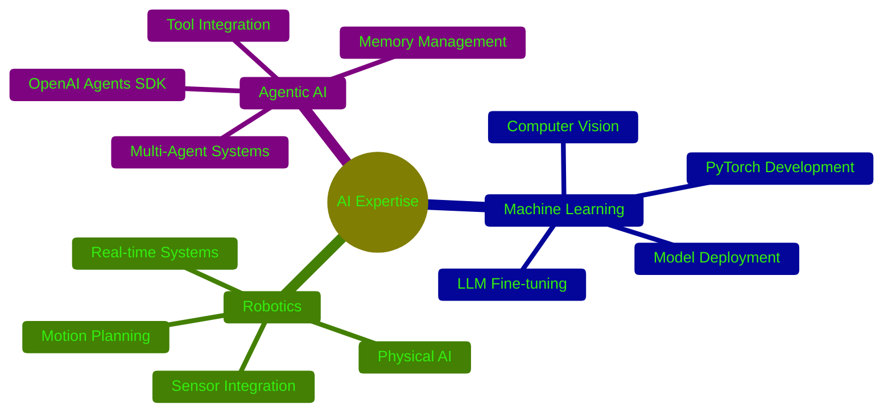
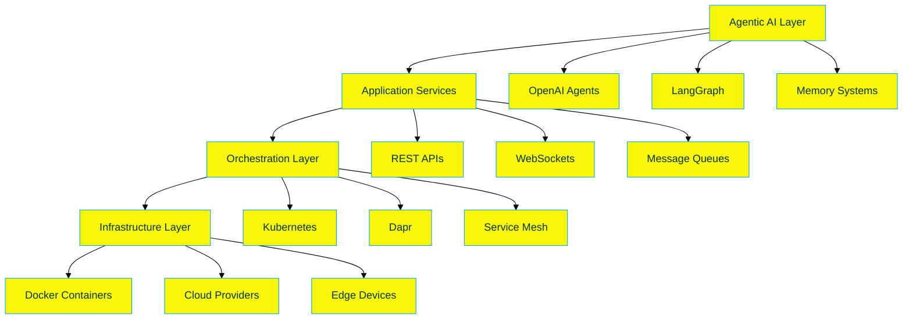

  
# 🌟 Muhammad Ahmed 🌟
### Aspiring Agentic AI & Robotics Engineer (CAARE Student)
### 🤖 AI Developer | 🚀 Robotics Enthusiast | 💻 Full-Stack Developer

---

## 🎯 About Me

> *"The AI Revolution is Here: The Future Belongs to the Architects of Intelligence"*

I'm **Muhammad Ahmed**, a passionate **CAARE (Certified Agentic AI & Robotics Engineer) student** currently advancing through cutting-edge programs at **Panaversity**. I'm on an exciting journey to master the design, building, and deployment of autonomous software agents and physical robots that operate reliably, securely, and at scale.

### 🚀 Current Mission
Immersing myself in the world of artificial intelligence and robotics, I'm building foundational expertise in agentic AI systems while working towards becoming a certified professional who can bridge AI innovation with real-world applications.

---

## 🎓 Education & Certifications

### � Learning Journey - CAARE Program
*Comprehensive multi-level curriculum in autonomous AI systems*

| **Program** | **Focus Area** | **Status** |
|-------------|----------------|------------|
| 🤖 **Modern AI Python** | Type Hints, Advanced Python | ✅ **Completed** |
| 🧠 **OpenAI Agents SDK** | Agent Development & Integration | ✅ **Completed** |
| 🌐 **N8N Agentic AI** | Workflow Automation & LLMs | 🔄 **Currently Learning** |
| 🏗️ **Agentic AI Fundamentals** | Memory, MCP, Multi-Agent Systems | 📚 **Next Phase** |
| 🏗️ **Cloud-Native AI Agents** | Kubernetes, Docker, Dapr | � **Upcoming** |
| 🦾 **Physical AI & Robotics** | Humanoid Robotics Systems | 📅 **Future Goal** |

---

## 💻 Technical Arsenal

### 🤖 AI & Machine Learning

### 🌐 Web Development

### ☁️ Cloud & DevOps

### 🛠️ Tools & Platforms

---

## 🏗️ Learning Projects & Current Focus

### 🎯 Areas of Study & Development

| 🤖 **Agentic AI Systems** | 🐍 **Modern Python Development** | 🌐 **AI Workflows** |
|---------------------------|----------------------------------|---------------------|
| • OpenAI Agents SDK Learning | • Advanced Type Hints Mastery | • N8N Automation (Learning) |
| • Multi-Agent Concepts | • Modern Python Best Practices | • LLM Integration Patterns |
| • Memory Management Systems | • Async/Await Programming | • Workflow Orchestration |
| • Tool Integration Basics | • Testing & Code Quality | • Visual Agent Development |

### 🚀 Current Learning Projects

<b>🧠 OpenAI Agents SDK Mastery</b>

- **Agent Development** - Building intelligent conversational agents
- **Tool Integration** - Custom function tools with automatic validation  
- **Handoff Patterns** - Learning agent coordination techniques
- **Session Management** - Understanding conversation state handling

<b>🐍 Modern Python Expertise</b>

- **Type Hints Mastery** - Advanced static typing for robust code
- **Async Programming** - Modern concurrent programming patterns
- **Best Practices** - Writing maintainable, scalable Python code
- **Testing Frameworks** - Comprehensive testing strategies

<b>🌐 N8N Workflow Learning</b>

- **Visual Automation** - Learning drag-and-drop AI workflows
- **LLM Integration** - Connecting various language models
- **API Orchestration** - Building complex automation chains
- **Real-world Applications** - Practical workflow implementations

---

## 📊 GitHub Analytics

  
  

  

  

---

## 🏆 Achievements & Milestones

| 🎯 **Milestone** | 📅 **Date** | 🏅 **Achievement** |
|------------------|-------------|-------------------|
| Modern AI Python | 2024 | ✅ Successfully Completed |
| OpenAI Agents SDK | 2024 | ✅ Successfully Completed |
| CAARE Program Start | 2024 | 🚀 Enrolled in Full Program |
| N8N Agentic AI | 2025 | 🔄 Currently Learning |

---

## 🌟 Key Competencies

### 🧠 AI & Machine Learning Expertise

### 🏗️ System Architecture

---

## 📚 Continuous Learning Journey

### 📖 Currently Learning
- **CAARE Program at Panaversity** - Comprehensive AI & Robotics curriculum
- **N8N Workflow Automation** - Visual AI agent development and LLM integration
- **Advanced Python Patterns** - Building on modern Python foundation
- **Agentic AI Concepts** - Multi-agent systems and coordination patterns

### 🎯 Upcoming Learning Goals
- **Advanced Agentic AI** - Memory systems, MCP, and complex orchestration
- **Cloud-Native AI** - Kubernetes, Docker, and Dapr for AI workloads
- **Physical AI & Robotics** - Bridging digital and physical intelligence
- **Production AI Systems** - Scalable, secure, and reliable deployments

### ✅ Recently Completed
- **Modern AI Python** - Advanced type hints, async programming, best practices
- **OpenAI Agents SDK** - Agent development, tools, handoffs, and sessions

---

## 🤝 Let's Connect & Collaborate!

### 💼 Learning & Career Aspirations
I'm actively developing skills for future opportunities in:
- **Agentic AI Development** - Building intelligent autonomous systems
- **AI Software Engineering** - Modern Python and AI system development
- **Machine Learning Engineering** - Production-ready AI solutions
- **Technical Innovation** - Contributing to AI advancement and research

### 📞 Get In Touch

---

### 🌟 *"Learning to Build the Future with AI, One Step at a Time"* 🌟

  

**⭐ Star my repositories if you find them interesting!**  
**🤝 Let's collaborate on the next breakthrough in AI and Robotics!**

---

